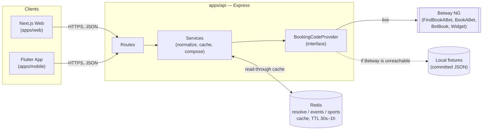
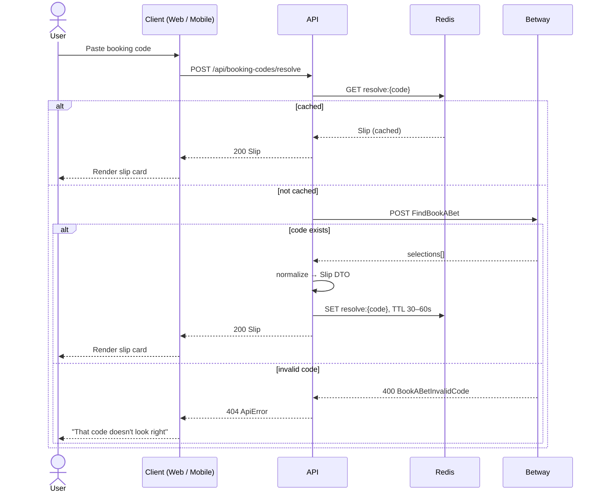
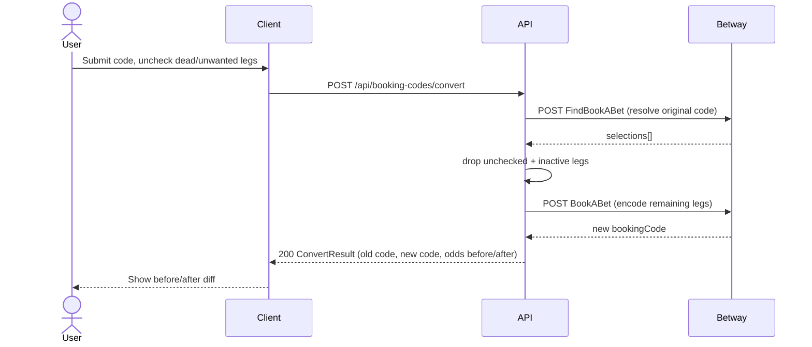

# Architecture diagrams — Betway Nigeria Booking Code Product

Three diagrams: how the pieces fit together, then the two flows that matter — Decode (a
read, cached) and Convert (a composition of two Betway calls, not a call of its own).

---

## 1. System overview

Both clients are equal, plain HTTP consumers of one API — neither talks to Betway directly.
`BookingCodeProvider` is the one seam in the whole system: swap `Betway` for `Fixtures` here
and nothing above it (Services, Routes, either client) changes. No database in this picture —
Redis is the only store, and it's a cache, not a source of truth (`docs/backend.md` §1, §5).

---

## 2. Decode — a cached read

The cache sits in front of every request, not just repeated ones — a code decoded once by
any user is instant for the next 30–60 seconds for anyone else, and Betway sees one call
instead of many.

---

## 3. Convert — composition, not a Betway endpoint

Betway has no "convert" endpoint — Convert is `resolve` then `encode`, composed entirely on
our side (`docs/backend-api.md` §1). On a single bookmaker this is close to a formality; the
real complexity Convert is built to eventually carry is cross-bookmaker mapping, which this
composition point is the seam for, not something this assessment implements.